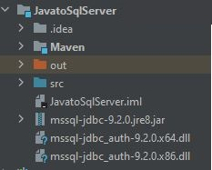

Download Microsoft JBDC Driver for SQL Server
=============================================
In order to connect Java to Microsoft SQL Server, you will want to download and
install  the appropriate JDBC driver and have it present in the classpath.
`Click here <https://docs.microsoft.com/en-us/sql/connect/jdbc/download-microsoft-jdbc-driver-for-sql-server?view=sql-server-ver15>`_
to download the latest version of Microsoft JDBC Driver for SQL Server.

Once it is downloaded, extract the jar file associated with the which version of
JAVA you have.  If you do not have JAVA `click here <https://www.java.com/en/>`_ to download it.

For example if using JAVA version 8 then you will want to extract ``mssql-jdbc-9.2.0.jre8.jar``

Extract the jar file to you project file. Also if you are using integrated security with SQL Server
then extract ``mssql-jdbc_auth-9.2.0.x64.dll`` or ``mssql-jdbc_auth-9.2.0.x86.dll`` file,
depending which version of Windows 10 you have.

