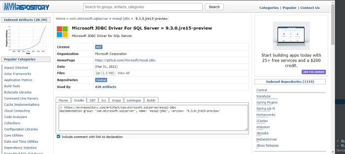

Gradle
======

We started off this project with Maven and switched to Gradle as Gradle is easier
to use for creating servlets.  Maven can make customization difficult and might
not even be possible.  Maven is not really suitable for many automation needs.
To get more information click `Gradle`_.

.. _Gradle: https://gradle.org/

To start working with **Gradle** in **IntelliJ**:

    1.  Create a a new project.
    2.  Click on ``Java Enterprise``
    3.  Under ``Build system``, select **Gradle**

        .. image:: GradleSelection.JPG
    4.  Click **Next**
    5.  Select the appropriate dependencies depending on what you are wanting to do.  We are creating servlets
        and selected servlets from the list.

        .. image:: Dependencies.JPG

In the Gradle project, there will be a file **build.gradle**.  That file will specify all the libraries
used in your project.  There is no need to find or download libraries, Gradle takes care of that.
You just have to tell gradle what libraries you want.

For libraries I have found `MVNRepository`_ a good resource.  You can
search for the library you are looking for example SqlServer, will bring up a list of libraries.
Select the appropriate one and it will provide the formatted code that is needed to add to your **build.gradle**
file.

.. _MVNRepository: https://mvnrepository.com/

You will update **build.gradle** something like this

    .. code-block:: java

        dependencies {
        implementation('javax.json.bind:javax.json.bind-api:1.0')
        implementation('org.glassfish:jakarta.json:1.1.5')
        implementation('org.eclipse:yasson:1.0.3')
        compileOnly('javax.servlet:javax.servlet-api:4.0.1')
        implementation('mysql:mysql-connector-java:8.0.23')
        implementation('com.microsoft.sqlserver:mssql-jdbc')
        implementation ('com.microsoft.sqlserver:mssql-jdbc:9.2.0.jre8')
        // https://mvnrepository.com/artifact/com.microsoft.sqlserver/sqljdbc_auth
        implementation ('com.microsoft.sqlserver:mssql-jdbc_auth:9.2.1.x64')
        implementation ('com.microsoft.sqlserver:mssql-jdbc_auth:9.2.1.x86')
        testImplementation("org.junit.jupiter:junit-jupiter-api:${junitVersion}")
        testRuntimeOnly("org.junit.jupiter:junit-jupiter-engine:${junitVersion}")
        }

.. note::

    We recommend if querying ``SQL Server`` using Gradle, that you do not use integrated authentication,
    instead create and/or use a username and password in ``SQL Server``.   We found great difficulty passing
    the integrated authentication.