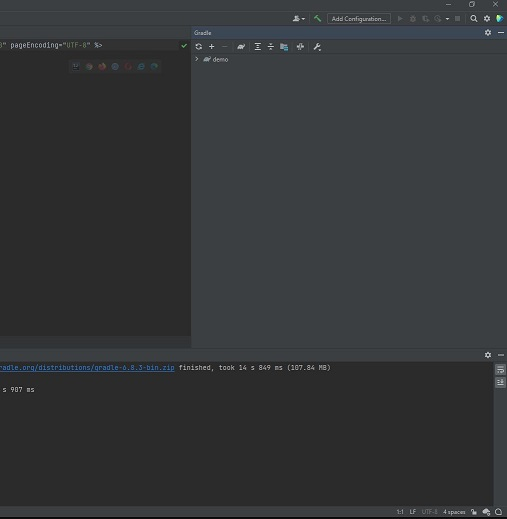
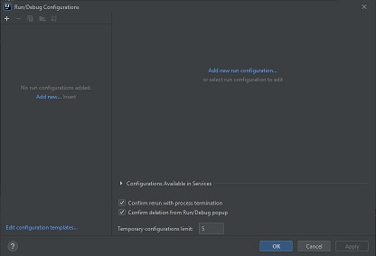
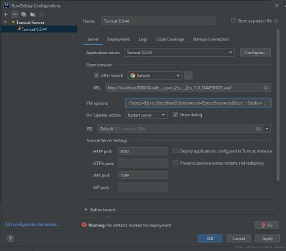

Creating Servlets
=================

When starting to create servlets we decided to use **Environment Variables**. This will allow us to pass the
username, password, and connection stream to **SQLServer**, without having to enter it on every servlet.

To setup the environment variables, we need to change the **context.xml** to use the environment variables
sensitive fields.

Updated context.xml
-------------------

The code below uses environmental variables instead of hard coded values for username, password, and the JDBC
connection string:

.. code-block:: xml
    :caption: Updated context.xml lines
    :emphasize-lines:  11-13

    <?xml version="1.0" encoding="UTF-8"?>
    <Context>
    <Resource name="jdbc/j2ss"
              auth="Container"
              type="javax.sql.DataSource"
              maxTotal="50"
              maxActive="15"
              maxIdle="10"
              maxWaitMillis="-1"
              driverClassName="com.microsoft.sqlserver.jdbc.SQLServerDriver"
              username="${user}"
              password="${password}"
              url="${jdbc}"
              testOnBorrow="true"
              removeAbandoned="true"
              removeAbandonedTimeout="55"
              validationQuery="SELECT 1"
              validationInterval="34000"
              timeBetweenEvictionRunsMillis="34000"
              minEvictableIdleTimeMillis="55000"
              factory="org.apache.tomcat.jdbc.pool.DataSourceFactory"
    />
    <ResourceLink name="jdbc/j2ss"
                  global="jdbc/j2ss"
                  type="javax.sql.DataSource" />
    </Context>

Tomcat
------

We are also using **Apache Tomcat** to implement the servlets.  We are using **Tomcat 9.0.44** as
we found less issues with trying to run our queries in **SQL Server**.  Here is the link to download
Apache Tomcat https://tomcat.apache.org/download-90.cgi .  Feel free to use whatever version you would like.

You can download the core files for your particular bit of Windows, 32 or 64 bit, or in our case we just grabbed the
zip file which is not bit specific.  There is also a Windows service installer. We then extracted the files
from the zip file to the C:\ drive.

Configuring IntelliJ for Tomcat
-------------------------------

In your project you will want to click on ``Add Configuration`` in the right hand corner

Once the Run/Debug Configurations opens, to add a configuration click on the ``+`` sign at the top left.

Scroll down the list and find ``Tomcat Server`` and click desired option either local or remote.  We chose local.
The configuration screen will appear and it should ultimately look like this:

In the VM options field is where you will add the environment variables. It should look something like
``-Duser=EnterUserName-Dpassword=EnterPasswordHere -Djdbc=jdbc:sqlserver://localhost;databaseName=YourDataBaseName``

Creating your 1st Servlet:
--------------------------

When building Gradle you had the option to select Servlet from the list of dependencies.  Gradle will build a
basic servlet.

.. code-block:: java
    :linenos:

    package com.j2ss.j2ss;
    import java.io.*;
    import javax.servlet.http.*;
    import javax.servlet.annotation.*;
        @WebServlet(name = "helloServlet", value = "/hello-servlet")
    public class HelloServlet extends HttpServlet {
        private String message;
            public void init() {
            message = "Hello World!";
        }
        public void doGet(HttpServletRequest request, HttpServletResponse response)
        throws IOException {
            response.setContentType("text/html");
                // Hello
            PrintWriter out = response.getWriter();
            out.println("<html><body>");
            out.println("<h1>" + message + "</h1>");
            out.println("</body></html>");
        }
            public void destroy() {
        }
    }

Using the basic servlet frame work you can then incorporate your already established codes to query SQL Server and
have the results displayed in a servlet.

As mentioned above we are using environment variables for the username, password, and link.

.. code-block:: java
    :caption: Updated Java code to verify connection to SQL Server
    :emphasize-lines: 13,15,17,18
    :linenos:

    import javax.naming.Context;
    import javax.naming.InitialContext;
    import javax.naming.NamingException;
    import javax.sql.DataSource;
    import java.io.PrintWriter;
    import java.sql.*;

    public class JavaToSql {
    public static void main(String[] args) {printdbinfo(new PrintWriter(System.out));}
        public static void printdbinfo(PrintWriter out){
            Connection conn = null;
            try {
                // Create a context. Uses context.xml
                Context initContext = new InitialContext();
                // Select which context to lookup.
                Context envContext = (Context) initContext.lookup("java:/comp/env");
                // Grab a source of database connection. Note how this matches the name
                // field in context.xml.
                DataSource ds = (DataSource) envContext.lookup("jdbc/j2ss");
                // Hey, now we've got a datasource for connections. Let's get a connection.
                conn = DriverManager.getConnection(dbURL);
                if (conn != null) {
                    DatabaseMetaData dm = (DatabaseMetaData) conn.getMetaData();
                    out.println("Driver name: " + dm.getDriverName());
                    out.println("Driver version: " + dm.getDriverVersion());
                    out.println("Product name: " + dm.getDatabaseProductName());
                    out.println("Product version: " + dm.getDatabaseProductVersion());
                    out.println("Connected to SQl Server");
                }
            } catch (SQLException | NamingException ex) {
                ex.printStackTrace();
            }
        }
    }

That was the query code now we need to create the servlet code to pull the information from our query and
display it in the servlet.

.. code-block:: Java
    :caption: Servlet Code
    :linenos:

    import jdbc.JavaToSql;
    import javax.servlet.annotation.WebServlet;
    import javax.servlet.http.HttpServlet;
    import javax.servlet.http.HttpServletRequest;
    import javax.servlet.http.HttpServletResponse;
    import java.io.IOException;
    import java.io.PrintWriter;

    @WebServlet(name = "dbinfoservlet", value = "/dbinfoservlet")
    public class DBInfoServlet extends HttpServlet {
        private String message;
        public void init() {
            message = "Hello World!";
        }
        public void doGet(HttpServletRequest request, HttpServletResponse response) throws IOException {
            response.setContentType("text/plain");
            // Hello
            PrintWriter out = response.getWriter();
            JavaToSql.printdbinfo(out);
        }
           public void destroy() {
        }
    }

Coding Java inside servlet code
-------------------------------

You can even include the java code in the servlet as shown in this example which extracts a `binary image`
from **SQL Server** and displays it in the servlet.

.. code-block:: java
    :caption: Extracting Binary Image and displaying in a servlet
    :emphasize-lines: 40
    :linenos:

    import javax.naming.Context;
    import javax.naming.InitialContext;
    import javax.naming.NamingException;
    import javax.servlet.ServletException;
    import javax.servlet.ServletOutputStream;
    import javax.servlet.annotation.WebServlet;
    import javax.servlet.http.HttpServlet;
    import javax.servlet.http.HttpServletRequest;
    import javax.servlet.http.HttpServletResponse;
    import javax.sql.DataSource;
    import java.io.IOException;
    import java.io.InputStream;
    import java.sql.*;

    @WebServlet(name = "getb_imageservlet", value = "/getb_imageservlet")
    public class GetB_ImageServlet extends HttpServlet{
        private String message;
        public void init() {
            message = "Hello World!";
        }
        public void doGet(HttpServletRequest request, HttpServletResponse response)
        throws IOException, ServletException {
            PreparedStatement stmt = null;
            ResultSet rs = null;
            Connection conn = null;
            ServletOutputStream out = response.getOutputStream();
            Context initContext = null;
            try {
                initContext = new InitialContext();
                Context envContext = (Context) initContext.lookup("java:/comp/env");
                DataSource ds = (DataSource) envContext.lookup("jdbc/j2ss");
                conn = ds.getConnection();
                String sql =  "SELECT * " +
                        "From dbo.Pics "+
                        "Where PictureName = 'ISU' ";
                stmt = conn.prepareStatement(sql);
                rs = stmt.executeQuery();
                while (rs.next()) {
                    Blob blob = rs.getBlob("Data");
                    // In this instance we want to change the content type to image/jpg
                    response.setContentType("image/jpg");
                    InputStream inputStream = blob.getBinaryStream();
                    int bytesRead = (int) blob.length();
                    byte[] buffer = new byte[8192];
                    while ((bytesRead = inputStream.read(buffer)) != -1) {
                        out.write(buffer,0, bytesRead);
                    }
                    inputStream.close();
                }
            } catch (NamingException | SQLException e) {
                e.printStackTrace();
            }
        }
        public void destroy() {
        }
    }

