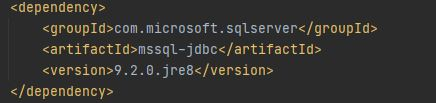

Add Maven to IntelliJ
=====================
To help build the project we used Maven.  To get more info click on
`Maven <https://maven.apache.org/what-is-maven.html>`_.

`Click here <https://maven.apache.org/download.cgi>`_ to download Maven, if needed.

To add Maven to IntelliJ:
    1.  Right click on your project folder in IntelliJ.
    2.  Click New; Module

        .. image:: NewModule.JPG

    #.  Click Next
    #.  Give your module a name, we chose **maven**

        .. image:: NameModule.JPG

    #.  Click Finish

Once the Maven Module is created a pom.xml file will appear.

.. literalinclude:: pom.xml
   :language: xml

This will need to be updated with:

Below is the updated pom.xml file.

.. literalinclude:: Updatedpom.xml
   :language: xml
