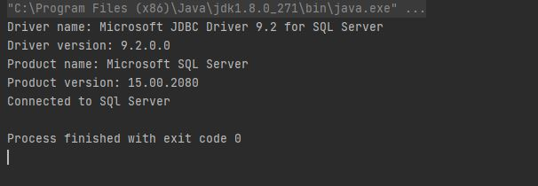

Connect Java to SQL Server
==========================

The following syntax of the database URL is needed to connect to SQL Sever.
``jdbc:sqlserver://[serverName[\instanceName][:portNumber]][;property=value[;property=value]]``

Where:
    - The ``jdbc:sqlserver://`` (**Required**) is known as the sub-protocol and it is a constant.
    - The ``serverName`` (**Optional**) is the host name or the IP address of the machine that SQL Server is running on.
    - The ``instanceName`` (**Optional**) is the name of the instance to connect to the ``serverName``.  If this is not specified, a default connection is made.
    - The ``portNumber`` (**Optional**) is the port to connect to on serverName.  The default port is 1433.
      If you are using the default you do not need to specify the port or the preceding ':' in the URL.
    - The ``property`` (**Optional**) is one or more connection properties.  For example your ``username``, ``password``, or the ``database`` you want to connect to.
    - If you are using Windows authentication, using your Windows user account to log on to SQL Server.  This is used
      when the client and SQL Server are running on the same machine.   If you are wanting to use this option then we
      have to specify this by adding the **property** ``integratedSecurity=true`` to the URL.
        - For example:  ``jdbc:sqlserver://localhost;integratedSecurity=true;``
    - If you are using SQL Server authentication then we will have to specify your SQL Server username and password.
        - For example:  ``jdbc:sqlserver://localhost;user=SQLUserName;password=SQLPassword;``

Examples
--------
Here is an example using the elements:
    ``jdbc:sqlserver://localhost:1433;databaseName=testdb;user=SQLUserName;password=SQLPassword;``

For our example to test the connection  to SQL Server we used:
    ``jdbc:sqlserver://localhost; integratedSecurity=true``

Code
----
The code below demonstrates a simplified way to verify your connection to SQL Server.

    .. code-block:: java
        :linenos:
        :emphasize-lines: 2, 13, 17, 18, 26, 27

        package net.codejava.jdbc;
        //Here we are importing the different ``java.sql`` elements you can just as easily use ``import java.sql.*``
        import java.sql.Connection;
        import java.sql.DatabaseMetaData;
        import java.sql.DriverManager;
        import java.sql.SQLException;

        public class JavaToSql {
            public static void main(String[] args) {
                Connection conn = null;

                try {
                    //This is the data base url that we are using, as explained above
                    String dbURL = "jdbc:sqlserver://localhost; integratedSecurity=true";
                    conn = DriverManager.getConnection(dbURL);
                    if (conn != null) {
                        //We are calling the ``DatabaseMetaData`` to get the meta data from SQL Server.
                        DatabaseMetaData dm = (DatabaseMetaData) conn.getMetaData();
                        //Here we are just asking it to print some SQL Server information just to verify that
                        //a connection was made.
                        System.out.println("Driver name: " + dm.getDriverName());
                        System.out.println("Driver version: " + dm.getDriverVersion());
                        System.out.println("Product name: " + dm.getDatabaseProductName());
                        System.out.println("Product version: " + dm.getDatabaseProductVersion());
                        System.out.println("Connected to SQl Server");
                    }
                } catch (SQLException ex) {
                //We are asking Java to print the skip trace(where there is an error) if an error
                //occurs while connecting
                    ex.printStackTrace();
                }
            }
        }

The results should show something similar to this

