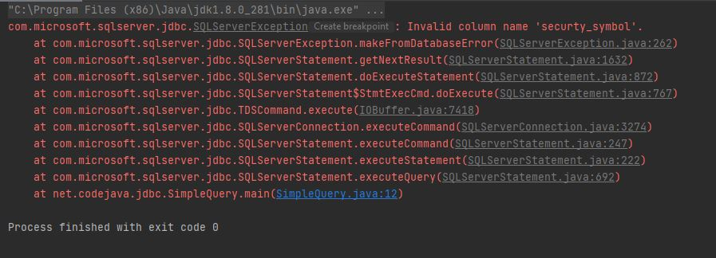

Error Handling
==============

Simple Error
------------

When querying ``SQL Server`` with ``java`` there is a very good chance that an error will occur somewhere.
What does an error look like when querying ``SQL Server`` with ``java``?

Here is a simple example:

 .. code-block:: Java
    :linenos:

    package net.codejava.jdbc;

    import java.sql.*;

    public class SimpleQuery {
        public static void main(String[] args) {
            Connection conn = null;
            try {
                String dbURL = "jdbc:sqlserver://localhost;databaseName=GAFA; integratedSecurity=true";
                conn = DriverManager.getConnection(dbURL);
                Statement stmt = conn.createStatement();
                ResultSet rs = stmt.executeQuery("Select securty_symbol from dbo.StockPrices ");
                while(rs.next()){
                    String sym = rs.getString("security_symbol");
                    System.out.println(sym);
                }
            } catch (SQLException ex) {
                ex.printStackTrace();
            }
        }
    }

Output:

This is a simple example where the column name was mistyped in the select statement.  As you can see on the second line
of the output it calls out ``Invalid column name 'securty_symbol'``.

